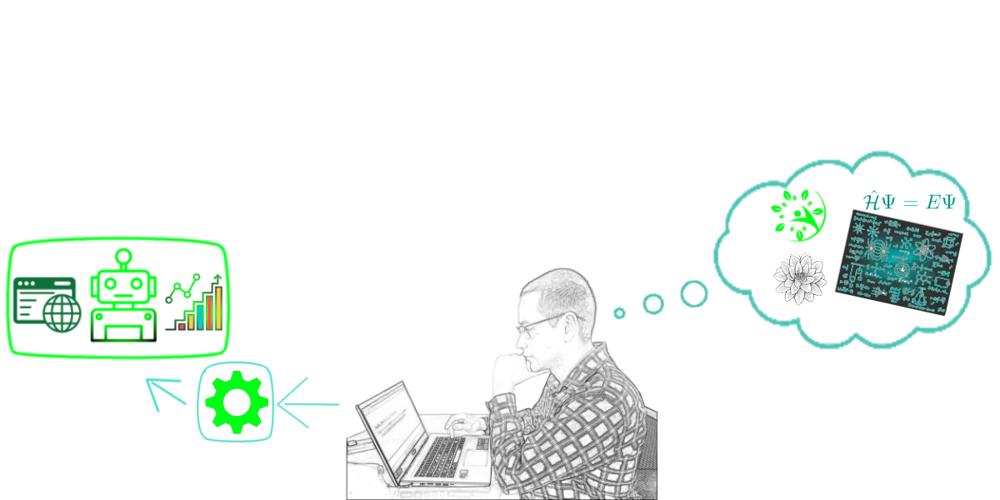

# Portfolio

> This are the source code for my portfolio site.

### Built With

* Django
* SASS
* HTML
* JavaScript
* Python
* Bootstrap

(<a href="#readme-top">back to top</a>)

## 💻 Live on <a href='https://portfolio-wallacepp.herokuapp.com/'>this free heroku app</a>

## Contact

Wallace Pannace - [Linkedin](https://www.linkedin.com/in/wallace-pannace-48ba72249/) - wallacepncp@gmail.com

(<a href="#readme-top">back to top</a>)

